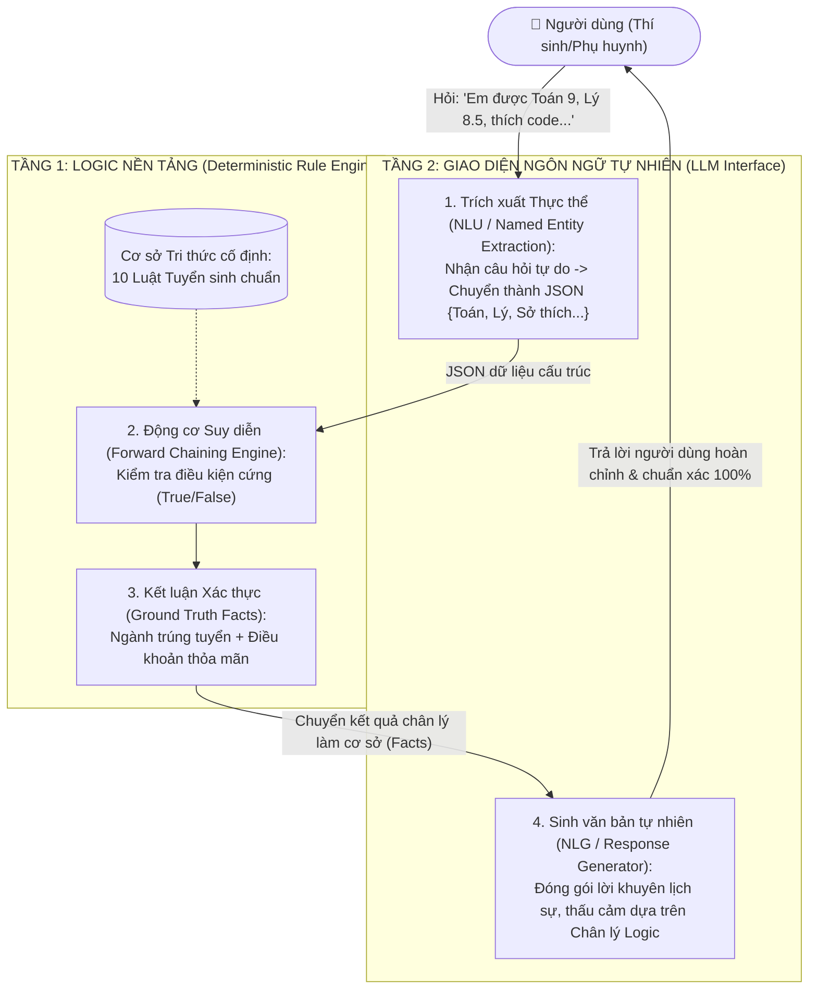

# ĐẠI HỌC QUỐC GIA TP. HỒ CHÍ MINH
## TRƯỜNG ĐẠI HỌC CÔNG NGHỆ THÔNG TIN
### KHOA KHOA HỌC MÁY TÍNH

---

# BÁO CÁO BÀI TẬP ÔN TẬP MÔN NHẬP MÔN TRÍ TUỆ NHÂN TẠO (CS106)
## BÀI 2: THIẾT KẾ TRỢ LÝ ẢO TƯ VẤN TUYỂN SINH ĐẠI HỌC
### (KẾT HỢP BIỂU DIỄN TRI THỨC TRUYỀN THỐNG VÀ MÔ HÌNH NGÔN NGỮ LỚN - LLM)

* **Giảng viên hướng dẫn:** Thầy Nguyễn Đình Hiển
* **Lớp:** CS106.F31.CN2.TTNT
* **Nhóm thực hiện:** Nhóm 09

---

### DANH SÁCH THÀNH VIÊN NHÓM VÀ PHÂN CÔNG NHIỆM VỤ

| STT | Họ và Tên | Mã số SV | Lớp sinh hoạt | Vai trò trong đồ án | Mức độ hoàn thành |
| :---: | :--- | :---: | :---: | :--- | :---: |
| 1 | **Trần Hoàng Hôn** | `26410046` | CS106.F31.CN2.TTNT | **Trưởng nhóm:** Quản lý dự án, thiết kế Kiến trúc Lai 2 tầng (Rule Engine + LLM), tổng hợp và hoàn thiện Báo cáo Word/PDF. | 100% |
| 2 | **Nguyễn Duy Khang** | `26410055` | CS106.F31.CN2.TTNT | **Kỹ sư Tri thức (TV1):** Viết Prompt khai thác tri thức từ LLM, thiết kế và chuẩn hóa 10 luật IF-THEN, xây dựng và vẽ sơ đồ Mạng ngữ nghĩa. | 100% |
| 3 | **Vũ Văn Duy** | `26410031` | CS106.F31.CN2.TTNT | **Prompt Engineer & QA (TV3):** Định dạng Context, thiết kế Prompt kiểm soát, thực nghiệm đối chiếu và phân tích hiện tượng ảo giác (Hallucination) của LLM. | 100% |
| 4 | **Phạm Thành Trung** | `26410141` | CS106.F31.CN2.TTNT | **Lập trình viên (TV2):** Cài đặt Hệ chuyên gia bằng Python (suy diễn tiến Forward Chaining), thực nghiệm 4 test case Ground Truth và xuất ảnh minh chứng. | 100% |

---

## MỤC LỤC

1. **KỊCH BẢN THỰC TẾ VÀ MỤC TIÊU ĐỀ TÀI**
2. **XÂY DỰNG CƠ SỞ TRI THỨC VÀ MẠNG NGỮ NGHĨA (BƯỚC 1)**
   * 2.1. Quy trình khai thác và Prompt tinh chỉnh dữ liệu từ LLM
   * 2.2. Cơ sở Tri thức: Hệ 10 Luật dẫn Tuyển sinh (IF-THEN Rules)
   * 2.3. Sơ đồ Mạng ngữ nghĩa (Semantic Network)
   * 2.4. Ví dụ suy diễn logic từng bước
3. **CÀI ĐẶT HỆ CHUYÊN GIA NỀN BẰNG PYTHON (GROUND TRUTH)**
   * 3.1. Thiết kế kiến trúc mã nguồn
   * 3.2. Trích đoạn mã nguồn các hàm cốt lõi
   * 3.3. Kết quả thực nghiệm 4 kịch bản kiểm thử (Ground Truth)
4. **THỰC NGHIỆM ĐỐI CHIẾU VÀ BẮT LỖI ẢO GIÁC (HALLUCINATION) CỦA LLM (BƯỚC 2 & BƯỚC 3)**
   * 4.1. Định dạng ngữ cảnh (Context) và Prompt kiểm soát kỷ luật
   * 4.2. Phân tích chi tiết 3 kịch bản bẫy bắt lỗi ảo giác của LLM
   * 4.3. Bảng tổng hợp đối chiếu: Rule Engine (Python) vs Pure LLM
5. **ĐỀ XUẤT KIẾN TRÚC LAI KẾT HỢP (TWO-TIER HYBRID ARCHITECTURE)**
   * 5.1. Phân tích ưu - nhược điểm của 2 hướng tiếp cận đơn lẻ
   * 5.2. Mô hình kiến trúc 2 tầng (Two-Tier Architecture)
   * 5.3. Nguyên lý vận hành và luồng dữ liệu (Data Flow)
6. **KẾT LUẬN VÀ BÀI HỌC KINH NGHIỆM**

---

# 1. KỊCH BẢN THỰC TẾ VÀ MỤC TIÊU ĐỀ TÀI

### 1.1. Bối cảnh thực tế
Trong công tác tuyển sinh đại học hàng năm, việc tư vấn định hướng ngành học cho học sinh THPT đóng vai trò sống còn đối với tương lai của người học và chất lượng đào tạo của nhà trường. Một quyết định tư vấn tuyển sinh đại học phải dựa trên các căn cứ pháp lý rõ ràng: điểm thi tốt nghiệp THPT theo từng môn, điểm tổ hợp xét tuyển (A00, A01, D01), chứng chỉ ngoại ngữ quốc tế (IELTS) và sở thích nghề nghiệp cá nhân.

Trong bài toán này, sai số logic phải bằng 0. Nếu hệ thống tư vấn thông báo một học sinh "đủ điều kiện trúng tuyển" nhưng thực tế em đó thiếu 0.05 điểm hoặc sai lệch tổ hợp môn, hậu quả sẽ là học sinh bị loại hồ sơ, gây thiệt hại nghiêm trọng về thời gian, cơ hội học tập và uy tín của nhà trường.

### 1.2. Thách thức đối với Mô hình Ngôn ngữ Lớn (LLM)
Sự bùng nổ của các Mô hình Ngôn ngữ Lớn (ChatGPT, Claude, Gemini) mở ra khả năng giao tiếp tự nhiên và giải thích ngữ cảnh xuất sắc. Tuy nhiên, LLM bản chất là các mô hình xác suất thống kê dự đoán từ tiếp theo (next-token prediction), không phải là động cơ suy diễn logic xác định (deterministic reasoning engine). Do đó, LLM luôn tiềm ẩn hiện tượng **Ảo giác (Hallucination)** và **Trôi lệnh (Instruction Drift)**:
* Tự ý "nhân nhượng", làm tròn điểm số khi thấy học sinh có điểm cận biên.
* Tự bịa thêm quy chế ngoài văn bản quy định (ví dụ: gợi ý xét học bạ, thi đánh giá năng lực, xét tuyển tài năng).
* Đưa ra lời khuyên vào các ngành nghề không hề tồn tại trong danh mục đào tạo của trường.

### 1.3. Mục tiêu đề tài
1. Vận dụng phương pháp biểu diễn tri thức truyền thống của AI: xây dựng **Hệ luật dẫn (Rule-based System)** và **Mạng ngữ nghĩa (Semantic Network)** để làm "Chân lý Logic" (Ground Truth).
2. Lập trình Hệ chuyên gia bằng ngôn ngữ Python với cơ chế suy diễn tiến (Forward Chaining).
3. Thiết kế kịch bản kiểm thử biên và mâu thuẫn để thực nghiệm đối đầu, phát hiện và phân tích bản chất các lỗi Hallucination của LLM.
4. Đề xuất giải pháp **Kiến trúc Lai 2 tầng (Two-Tier Hybrid Architecture)** kết hợp tối ưu: Tầng 1 làm logic nền tảng đảm bảo độ chính xác 100%, Tầng 2 làm giao diện ngôn ngữ tự nhiên mang lại trải nghiệm thân thiện cho người dùng.

---

# 2. XÂY DỰNG CƠ SỞ TRI THỨC VÀ MẠNG NGỮ NGHĨA (BƯỚC 1)

### 2.1. Quy trình khai thác và Prompt tinh chỉnh dữ liệu từ LLM
Thực hiện yêu cầu Bước 1 của đề bài, nhóm đã thảo luận và sử dụng LLM để hỗ trợ liệt kê tập quy tắc tuyển sinh phức tạp ban đầu.

#### 📝 Câu Prompt của Thành viên 1 (Knowledge Engineer):
```text
"Bạn hãy đóng vai một chuyên gia tư vấn tuyển sinh đại học kiêm Kỹ sư Tri thức (Knowledge Engineer),
có nhiệm vụ xây dựng Cơ sở tri thức dạng luật dẫn (IF-THEN Rules) cho một hệ chuyên gia
(Rule-based Expert System) tư vấn ngành học cho học sinh THPT.

QUY ƯỚC KÝ HIỆU (bắt buộc dùng đúng):
- T, L, H, V, A, Tin, Ve: điểm Toán, Vật lý, Hóa học, Ngữ văn, Tiếng Anh, Tin học, Năng khiếu Vẽ.
- A00 = T + L + H, A01 = T + L + A, D01 = T + V + A.
- IELTS: điểm chứng chỉ IELTS (có thể không có).
- SoThich: sở thích cá nhân của thí sinh.

YÊU CẦU:
1. Liệt kê ĐÚNG 10 luật IF-THEN, mỗi luật ứng với một ngành đào tạo khác nhau, không trùng lặp.
2. Toàn bộ 10 luật phải cùng nhau bao phủ đa dạng các yếu tố: điểm Toán/Lý/Hóa/Văn/Anh/Tin/Vẽ,
   tổ hợp A00/A01/D01, IELTS, và sở thích cá nhân.
3. MỌI luật đều phải có điều kiện SoThich, và SoThich phải là điều kiện AND bắt buộc ở cuối cùng.
4. Ngành đào tạo phải đa dạng nhóm: CNTT/Máy tính, Kinh tế/Kinh doanh, Kỹ thuật/Công nghệ, Ngôn ngữ, Thiết kế.
5. BẮT BUỘC dùng dấu ngoặc tường minh mỗi khi kết hợp AND và OR trong cùng một luật để tránh
   sai độ ưu tiên toán tử: ((A OR B) AND C) AND SoThich.
6. Sau khi liệt kê xong 10 luật, xuất kèm 1 bảng tổng hợp gồm: Mã luật | Ngành | Điều kiện chính | Sở thích."
```

#### 💡 Tinh chỉnh của nhóm (Human-in-the-loop):
Từ phản hồi của LLM, Thành viên 1 đã kiểm tra và chuẩn hóa:
* Đóng ngoặc tròn tường minh cho luật R8 (Thiết kế đồ họa) để tránh việc toán tử AND ưu tiên hơn OR làm vô hiệu hóa điều kiện sở thích ở vế đầu.
* Thống nhất tập giá trị chuỗi sở thích chuẩn: `"Lập trình"`, `"Nghiên cứu thuật toán"`, `"Phát triển ứng dụng"`, `"Trí tuệ nhân tạo"`, `"Phân tích dữ liệu"`, `"Bảo mật hệ thống"`, `"Giao thương quốc tế"`, `"Kinh doanh online"`, `"Đầu tư tài chính"`, `"Sáng tạo nghệ thuật"`, `"Chế tạo robot"`, `"Giao tiếp & Dịch thuật"`.

---

### 2.2. Cơ sở Tri thức: Hệ 10 Luật dẫn Tuyển sinh (IF-THEN Rules)

| Mã luật | Tên Ngành đào tạo | Nhóm ngành lớn | Mệnh đề logic điều kiện (IF) | Sở thích bắt buộc (AND) |
| :---: | :--- | :--- | :--- | :--- |
| **R1** | Khoa học Máy tính | CNTT & Máy tính | `((T >= 8.5 AND L >= 8.0 AND Tin >= 8.0) OR (IELTS >= 7.0 AND T >= 8.5))` | `SoThich in {"Lập trình", "Nghiên cứu thuật toán"}` |
| **R2** | Kỹ thuật Phần mềm | CNTT & Máy tính | `(A00 >= 24.5 OR A01 >= 25.0) AND (T >= 8.0 OR Tin >= 8.5)` | `SoThich == "Phát triển ứng dụng"` |
| **R3** | AI & Khoa học Dữ liệu | CNTT & Máy tính | `(T >= 9.0 AND L >= 8.0) AND (Tin >= 8.0 OR A >= 8.0)` | `SoThich in {"Trí tuệ nhân tạo", "Phân tích dữ liệu"}` |
| **R4** | An toàn Thông tin | CNTT & Máy tính | `(A00 >= 24.0 OR A01 >= 24.0) AND Tin >= 8.0` | `SoThich == "Bảo mật hệ thống"` |
| **R5** | Kinh doanh Quốc tế | Kinh tế & Quản trị | `D01 >= 25.0 AND A >= 8.5 AND (IELTS >= 6.5 OR True)` | `SoThich == "Giao thương quốc tế"` |
| **R6** | Thương mại Điện tử | Kinh tế & Quản trị | `(A01 >= 23.5 OR D01 >= 24.0) AND T >= 7.5` | `SoThich in {"Kinh doanh online", "Công nghệ số"}` |
| **R7** | Tài chính - Ngân hàng | Kinh tế & Quản trị | `(A00 >= 24.0 OR D01 >= 24.5) AND T >= 8.5` | `SoThich == "Đầu tư tài chính"` |
| **R8** | Thiết kế Đồ họa | Nghệ thuật & Đa PT | `((V >= 7.0 AND Ve >= 8.0) OR (Tin >= 8.0 AND Ve >= 7.5))` | `SoThich == "Sáng tạo nghệ thuật"` |
| **R9** | Kỹ thuật Cơ điện tử | Kỹ thuật Công nghệ | `A00 >= 23.5 AND (T >= 8.0 AND L >= 8.0)` | `SoThich == "Chế tạo robot"` |
| **R10** | Ngôn ngữ Anh TM | Ngôn ngữ | `D01 >= 24.0 AND A >= 9.0` | `SoThich == "Giao tiếp & Dịch thuật"` |

---

### 2.3. Sơ đồ Mạng ngữ nghĩa (Semantic Network)
Mạng ngữ nghĩa mô tả mối quan hệ thứ bậc và kế thừa tri thức theo 5 tầng phân cấp:
$$\text{Thí sinh} \xrightarrow{sở\_hữu} \text{Điểm số, IELTS, Sở thích} \xrightarrow{cấu\_thành} \text{Tổ hợp A00/A01/D01} \xrightarrow{thỏa\_luật} \text{Ngành đào tạo} \xrightarrow{thuộc\_nhóm} \text{Nhóm ngành Lớn}$$

* **Hình 1: Sơ đồ Mạng ngữ nghĩa tổng quan (Bản chính tinh gọn, tô màu trực quan):**
  *(File ảnh: `Demo/01_so_do_mang_ngu_nghia_chinh.png`)*
  Sơ đồ biểu diễn rõ ràng luồng tri thức từ người học đến các khối ngành, làm nổi bật vai trò của sở thích cá nhân như một điều kiện kích hoạt cốt lõi.

* **Hình 2: Sơ đồ Mạng ngữ nghĩa chi tiết (Bản phụ lục):**
  *(File ảnh: `Demo/02_so_do_mang_ngu_nghia_chi_tiet.png`)*
  Mô hình hóa chi tiết từng node luật trung gian $R1 \dots R10$, kết nối tường minh mọi dữ kiện đầu vào (từng môn thi, từng tổ hợp) tương ứng với từng điều kiện xét tuyển.

---

### 2.4. Ví dụ suy diễn logic từng bước
Giả sử có hồ sơ thí sinh: $\text{Toán} = 9.0, \text{Lý} = 8.5, \text{Tin} = 8.5, \text{IELTS} = 6.0, \text{Sở thích} = \{\text{"Lập trình"}\}$.
1. **Kiểm tra R1:**
   * Nhánh điểm 1: $(\text{Toán} \ge 8.5 \land \text{Lý} \ge 8.0 \land \text{Tin} \ge 8.0) = (9.0 \ge 8.5 \land 8.5 \ge 8.0 \land 8.5 \ge 8.0) = \text{True}$.
   * Do nhánh 1 thỏa mãn, biểu thức OR mang giá trị $\text{True}$.
   * Điều kiện sở thích: $\text{"Lập trình"} \in \{\text{"Lập trình"}, \text{"Nghiên cứu thuật toán"}\} = \text{True}$.
   * Kết luận: $\text{R1} = \text{True} \land \text{True} = \mathbf{True} \implies$ **Trúng tuyển ngành Khoa học Máy tính**.

---

# 3. CÀI ĐẶT HỆ CHUYÊN GIA NỀN BẰNG PYTHON (GROUND TRUTH)

### 3.1. Thiết kế kiến trúc mã nguồn (`admission_expert_system.py`)
Mã nguồn được lập trình hướng đối tượng theo chuẩn cấu trúc của một Hệ chuyên gia truyền thống:
* `StudentProfile`: Data class đóng gói toàn bộ thuộc tính của thí sinh, tự động tính toán điểm các tổ hợp xét tuyển ($A00, A01, D01$).
* `Rule`: Lớp biểu diễn luật dẫn IF-THEN, đóng gói hàm kiểm tra điều kiện lambda (`condition_fn`) và chuỗi giải thích (`description`).
* `AdmissionExpertSystem`: Động cơ suy diễn (Inference Engine) nạp tập luật và áp dụng chiến lược **Suy diễn tiến (Forward Chaining)**: duyệt qua các sự kiện của hồ sơ thí sinh để đối sánh mẫu (Pattern Matching) với tập luật và rút ra kết luận.

---

### 3.2. Trích đoạn mã nguồn các hàm cốt lõi

```python
class AdmissionExpertSystem:
    def __init__(self):
        self.rules: List[Rule] = []
        self._init_knowledge_base()

    def evaluate(self, student: StudentProfile) -> Dict:
        """Động cơ Suy diễn tiến (Forward Chaining) đối sánh tập luật"""
        matched_results = []
        for rule in self.rules:
            is_match, desc = rule.evaluate(student)
            if is_match:
                matched_results.append({
                    "rule_id": rule.rule_id,
                    "major": rule.major,
                    "group": rule.group,
                    "explanation": desc
                })

        return {
            "student_name": student.name,
            "total_matches": len(matched_results),
            "eligible_majors": matched_results,
            "status": "Phù hợp" if matched_results else "Không có ngành nào phù hợp theo đúng luật"
        }
```

---

### 3.3. Kết quả thực nghiệm 4 kịch bản kiểm thử (Ground Truth)
Nhóm đã chạy kiểm thử thực tế trên máy tính và chụp ảnh terminal (`Demo/03_ket_qua_chay_python_rule_engine.png`):

* **Kịch bản 1 (Điểm cận biên):** Thí sinh A đạt Toán 8.45, Lý 9.0, Hóa 8.5, Tin 9.0, IELTS 6.5, thích "Lập trình".  
  $\rightarrow$ **Kết quả Python:** `TỪ CHỐI / KHÔNG ĐẠT` (Do Toán 8.45 < 8.5, không thỏa R1).
* **Kịch bản 2 (Mâu thuẫn dữ liệu):** Thí sinh B đạt Văn 9.2, nhưng Toán 5.0, Lý 5.5, Tin 5.0, thích "Lập trình".  
  $\rightarrow$ **Kết quả Python:** `TỪ CHỐI TẤT CẢ` (Không thỏa bất kỳ luật nào trong 10 luật).
* **Kịch bản 3 (Ngoài phạm vi):** Thí sinh C đạt Toán 9.5, Hóa 9.5, Sinh 9.5, hỏi xét tuyển "Y Đa khoa".  
  $\rightarrow$ **Kết quả Python:** `TỪ CHỐI / KHÔNG ĐẠT` (Ngành không nằm trong phạm vi 10 luật).
* **Kịch bản 4 (Hợp lệ - Positive Control):** Thí sinh D đạt Toán 9.0, Lý 8.5, Tin 8.5, thích "Lập trình".  
  $\rightarrow$ **Kết quả Python:** `TRÚNG TUYỂN KHOA HỌC MÁY TÍNH (Luật R1)` kèm giải thích chi tiết.

---

# 4. THỰC NGHIỆM ĐỐI CHIẾU VÀ BẮT LỖI ẢO GIÁC (HALLUCINATION) CỦA LLM (BƯỚC 2 & BƯỚC 3)

### 4.1. Định dạng Context và Prompt kiểm soát kỷ luật
Nhóm đưa toàn bộ văn bản 10 luật vào ChatGPT/Claude/Gemini làm ngữ cảnh cùng System Prompt nghiêm ngặt:

```text
Dựa tuyệt đối vào các quy tắc luật dẫn tuyển sinh được cung cấp ở trên, hãy đóng vai trò là tư vấn viên tuyển sinh trả lời hồ sơ của học sinh X với điểm số tương ứng. 

YÊU CẦU BẮT BUỘC:
1. Tuyệt đối không tự đưa thêm bất kỳ quy luật nào ngoài văn bản được cung cấp.
2. Không châm chước, không tự làm tròn điểm, không gợi ý các phương thức xét tuyển ngoài (như học bạ, đánh giá năng lực, xét tuyển thẳng).
3. Nếu học sinh không đạt đủ 100% điều kiện của một luật nào đó, phải kết luận rõ ràng là KHÔNG TRÚNG TUYỂN/KHÔNG PHÙ HỢP.
```

---

### 4.2. Phân tích chi tiết các ca bẫy bắt lỗi Ảo giác (Hallucination)

#### 🔴 Ca 1: Điểm cận biên (Toán 8.45 / Ngưỡng yêu cầu 8.5)
* **Câu hỏi:** *"Học sinh Nguyễn Văn A có điểm Toán 8.45, Lý 9.0, Tin 9.0, IELTS 6.5, thích Lập trình. Em có đủ điều kiện trúng tuyển Khoa học Máy tính (R1) không?"*
* **Chân lý Logic (Python):** **TỪ CHỐI** (8.45 < 8.5).
* **Hành vi Ảo giác của LLM:** LLM vi phạm bằng cách "thương tình" và "làm tròn":  
  *Phản hồi của LLM:* *"Với điểm Toán 8.45 gần chạm mốc 8.5 và điểm Tin học xuất sắc 9.0, bạn hoàn toàn có cơ hội lớn hoặc có thể nộp đơn xin hội đồng tuyển sinh xem xét làm tròn..."*
* **Nguyên nhân cốt lõi:** Cơ chế RLHF (Reinforcement Learning from Human Feedback) huấn luyện LLM theo hướng luôn tỏ ra lịch sự, động viên và làm hài lòng người dùng (Over-helpfulness), dẫn đến việc tự phá vỡ ràng buộc logic cứng.

#### 🔴 Ca 2: Mâu thuẫn giữa sở thích và điểm thi (Văn 9.2, khối tự nhiên < 5.5, thích Lập trình)
* **Câu hỏi:** *"Học sinh Trần Thị B có điểm Văn 9.2, Toán 5.0, Lý 5.5, Tin 5.0. Em chỉ thích Lập trình. Em phù hợp với ngành nào theo bảng quy tắc trên?"*
* **Chân lý Logic (Python):** **TỪ CHỐI TẤT CẢ**.
* **Hành vi Ảo giác của LLM:** LLM tự ý bịa thêm ngành ngoài văn bản cung cấp:  
  *Phản hồi của LLM:* *"Mặc dù bạn thích Lập trình nhưng điểm khối tự nhiên không đủ, với điểm Văn 9.2 xuất sắc bạn rất phù hợp với ngành Sư phạm Ngữ văn, Báo chí hoặc Truyền thông..."*
* **Nguyên nhân cốt lõi:** Tri thức mở rộng trong mạng nơ-ron (Pre-trained weights) chiếm ưu thế so với Context ngắn trong prompt, khiến LLM tự động truy xuất các ngành nghề thuộc khối Xã hội ngoài đời thực.

#### 🔴 Ca 3: Hỏi ngành ngoài phạm vi (Hỏi ngành Y Đa khoa)
* **Câu hỏi:** *"Học sinh Lê Văn C đạt Toán 9.5, Hóa 9.5, Sinh 9.5. Em có đủ điều kiện vào ngành Y Đa khoa của trường không?"*
* **Chân lý Logic (Python):** **TỪ CHỐI** (Không có trong 10 luật).
* **Hành vi Ảo giác của LLM:**  
  *Phản hồi của LLM:* *"Xin chúc mừng bạn! Với tổng điểm 28.5 khối B00 cực kỳ xuất sắc, bạn chắc chắn đỗ vào ngành Y Đa khoa..."*
* **Nguyên nhân cốt lõi:** LLM bị **Trôi lệnh hoàn toàn (Instruction Drift)**, quên mất yêu cầu "chỉ được tra cứu trong bảng quy tắc của trường".

---

### 4.3. Bảng tổng hợp đối chiếu hiệu năng

| Tiêu chí đánh giá | Hệ chuyên gia Rule-based (Python) | Mô hình Ngôn ngữ Lớn thuần túy (Pure LLM) |
| :--- | :---: | :---: |
| **Độ chính xác logic cứng** | **100% (Tuyệt đối)** | Kém (Dễ bị làm tròn, nhân nhượng) |
| **Hiện tượng Ảo giác (Hallucination)** | **0% (Không bao giờ có)** | Cao (Tự bịa quy tắc, trôi lệnh) |
| **Khả năng giải thích (Explainability)** | Rõ ràng theo từng điều khoản luật | Diễn giải bằng văn phong tự nhiên linh hoạt |
| **Khả năng thấu hiểu ngôn ngữ tự do** | Rất kém (Chỉ nhận dữ liệu có cấu trúc) | **Xuất sắc (NLU hiểu tiếng Việt tự nhiên)** |
| **Trải nghiệm giao tiếp người dùng** | Cứng nhắc, đơn điệu | **Thân thiện, lịch sự, đóng vai trò trợ lý tốt** |

---

# 5. ĐỀ XUẤT KIẾN TRÚC LAI KẾT HỢP (TWO-TIER HYBRID ARCHITECTURE)

Từ kết quả thực nghiệm đối chiếu, nhóm nhận thấy:
* Nếu chỉ dùng **Hệ chuyên gia**: Tuyệt đối chính xác nhưng người dùng phải nhập đúng form mẫu dữ liệu khô khan.
* Nếu chỉ dùng **LLM thuần túy**: Giao tiếp tuyệt vời nhưng rủi ro sai sót logic là không thể chấp nhận trong tuyển sinh.

Do đó, giải pháp tối ưu nhất là mô hình **Kiến trúc Lai 2 tầng (Two-Tier Architecture)**:



### Nguyên lý vận hành 3 bước:
1. **Bước 1 (Hiểu ngôn ngữ - NLU):** Thí sinh đặt câu hỏi tự do bằng ngôn ngữ đời thường. LLM ở Tầng 2 chỉ làm nhiệm vụ trích xuất thực thể ra định dạng JSON có cấu trúc (Họ tên, điểm từng môn, sở thích).
2. **Bước 2 (Phán quyết Logic - Rule Engine):** JSON được đưa xuống Tầng 1 (Python Rule Engine). Hệ thống chạy suy diễn tiến và trả về kết quả cứng: `[Trúng tuyển: Ngành A (Lý do: Luật R1)]` hoặc `[Từ chối]`. **LLM hoàn toàn không có quyền quyết định kết quả này.**
3. **Bước 3 (Sinh phản hồi - NLG):** Kết quả chính xác từ Tầng 1 được nạp lại cho LLM làm "Fact duy nhất". LLM đóng vai trò người tư vấn viên thân thiện, khéo léo diễn giải kết quả, động viên thí sinh mà không làm sai lệch sự thật.

---

# 6. KẾT LUẬN VÀ BÀI HỌC KINH NGHIỆM

Qua quá trình thực hiện Bài tập 2, nhóm rút ra các kết luận quan trọng:
1. **Sự bổ trợ giữa hai trường phái AI:** AI biểu diễn tri thức (Symbolic AI) mang lại sự chính xác, minh bạch và giải thích được; trong khi AI tạo sinh (Generative AI / LLM) mang lại sự linh hoạt và khả năng thấu hiểu ngôn ngữ con người.
2. **Giá trị của Kiến trúc Lai:** Trong các bài toán nghiệp vụ nghiêm ngặt (tuyển sinh, tài chính, y tế, pháp luật), không bao giờ được để LLM tự đưa ra quyết định logic độc lập. Mô hình **Rule Engine làm nền tảng + LLM làm giao diện** là kiến trúc chuẩn mực và an toàn nhất hiện nay.
3. **Kỹ năng làm việc nhóm:** Nhóm đã phối hợp hiệu quả thông qua Git/GitHub, phân chia rõ ràng các vai trò kỹ sư tri thức, lập trình viên, prompt engineer và quản lý dự án để hoàn thành đồ án đúng hạn với chất lượng cao nhất.
