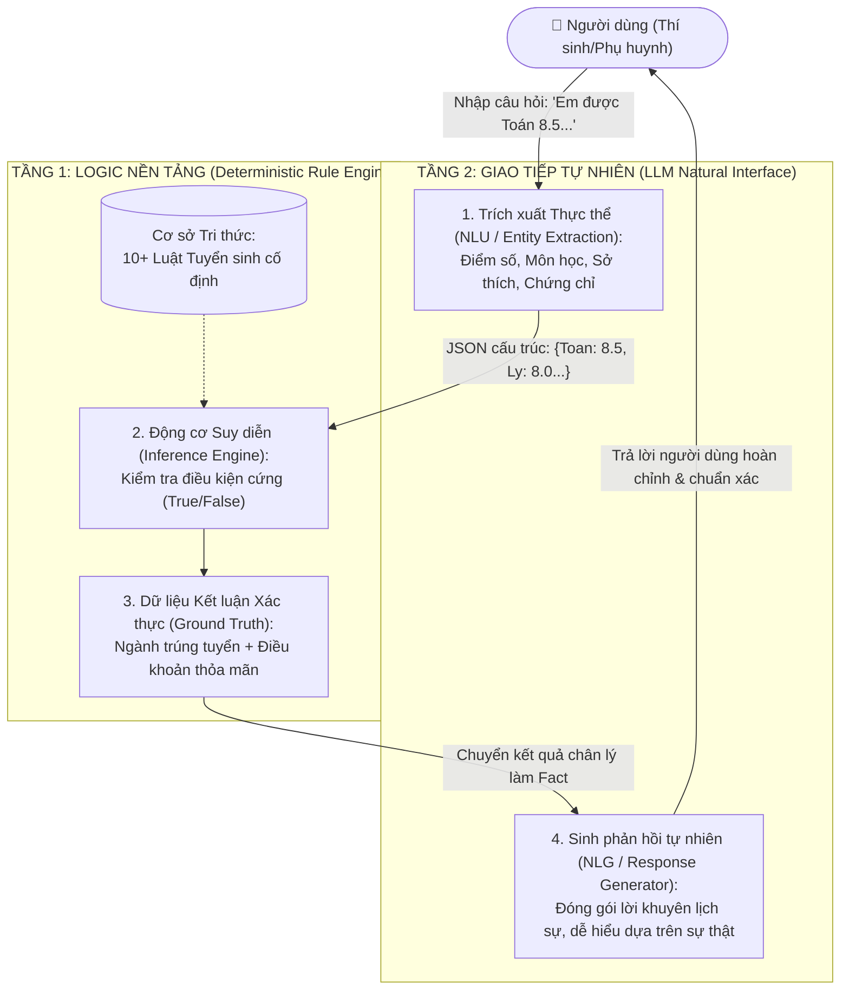

# ĐỀ XUẤT KIẾN TRÚC KẾT HỢP & DÀN Ý BÁO CÁO HOÀN CHỈNH
*(Dành cho Thành viên 4 - Lead & Technical Writer)*

---

## PHẦN 1: ĐỀ XUẤT GIẢI PHÁP KIẾN TRÚC LAI (HYBRID ARCHITECTURE)

### 1. Phân tích Điểm mạnh / Điểm yếu của 2 hướng tiếp cận đơn lẻ:
* **Hệ chuyên gia truyền thống (Rule-based Expert System):**
  * *Ưu điểm:* Độ chính xác logic 100%, tuân thủ tuyệt đối quy định, có khả năng giải thích nguồn gốc quyết định (Explainable AI), hoàn toàn không có ảo giác (Zero Hallucination).
  * *Nhược điểm:* Khô khan, cứng nhắc, không hiểu được câu hỏi tự nhiên linh hoạt của con người, trải nghiệm người dùng kém.
* **Mô hình Ngôn ngữ Lớn thuần túy (Pure LLM):**
  * *Ưu điểm:* Giao tiếp tự nhiên, thấu hiểu ngữ cảnh xuất sắc, trả lời mềm mại, lịch sự, đóng vai trò trợ lý trò chuyện rất tốt.
  * *Nhược điểm:* Dễ bị ảo giác (Hallucination), trôi lệnh (Instruction Drift), tự ý suy diễn hoặc nhân nhượng không đúng luật pháp/quy chế thi.

### 2. Mô hình Kiến trúc Lai 2 Tầng (Two-Tier Hybrid Architecture):
Để tận dụng tối đa thế mạnh của cả hai, nhóm đề xuất mô hình kiến trúc gồm 2 tầng tách biệt rõ ràng:



### 3. Nguyên lý vận hành:
1. **Bước 1 (Thu thập dữ liệu):** LLM nhận câu hỏi tự do của học sinh $\rightarrow$ trích xuất ra JSON cấu trúc (Họ tên, điểm số từng môn, sở thích).
2. **Bước 2 (Phán quyết logic):** JSON được đưa vào **Python Rule Engine**. Rule Engine thực thi suy diễn và trả về kết quả cứng: `[Trúng tuyển: Ngành A (Lý do: Luật R1)]` hoặc `[Không trúng tuyển]`.
3. **Bước 3 (Sinh câu trả lời):** Kết quả từ Rule Engine được đưa ngược lại cho LLM với chỉ thị: *"Dựa vào kết quả chính xác này, hãy viết lời tư vấn thân thiện, động viên và giải thích rõ cho thí sinh"*. Lúc này LLM không có quyền tự quyết định đậu/rớt mà chỉ làm nhiệm vụ ngôn ngữ (NLG).

---

## PHẦN 2: DÀN Ý KHUNG BÁO CÁO BÀI TẬP 2 (ĐỂ COPY VÀO FILE WORD)

### TRANG BÌA:
* Tên trường, Khoa CNTT
* Môn học: Trí tuệ Nhân tạo
* BÀI TẬP ÔN TẬP NHÓM - BÀI 2: THIẾT KẾ TRỢ LÝ ẢO TƯ VẤN TUYỂN SINH ĐẠI HỌC (BIỂU DIỄN TRI THỨC & LLM)
* Giảng viên hướng dẫn: Thầy Nguyễn Đình Hiển
* Danh sách thành viên nhóm (Họ tên, MSSV, Phân công)

---

### MỤC LỤC BÁO CÁO:

#### 1. ĐẶT VẤN ĐỀ VÀ KỊCH BẢN THỰC TẾ
* Tầm quan trọng của tư vấn tuyển sinh THPT.
* Yêu cầu về tính chính xác tuyệt đối (tránh sai sót gây hậu quả pháp lý cho học sinh).
* Mục tiêu kết hợp giữa AI truyền thống (Hệ luật dẫn) và AI hiện đại (LLM).

#### 2. XÂY DỰNG CƠ SỞ TRI THỨC & MẠNG NGỮ NGHĨA
* Bảng 10 luật dẫn IF-THEN chi tiết (Toán, Lý, Hóa, Văn, Anh, Tin, Vẽ, IELTS, Sở thích) - *Lấy từ file `rules_and_semantic_network.md`*.
* Biểu diễn dưới dạng Logic mệnh đề / Logic vị từ.
* Sơ đồ Mạng ngữ nghĩa (Chèn hình ảnh vẽ từ Mermaid hoặc Draw.io).

#### 3. CÀI ĐẶT HỆ CHUYÊN GIA NỀN BẰNG PYTHON
* Giới thiệu kiến trúc mã nguồn (`StudentProfile`, `Rule`, `AdmissionExpertSystem`).
* Trình bày các hàm chính: Hàm nạp luật, hàm kiểm tra điều kiện, hàm suy diễn tiến `evaluate()`.
* *Lưu ý: Chỉ trích các đoạn code hàm quan trọng nhất vào Word theo yêu cầu của thầy.*

#### 4. THỰC NGHIỆM ĐỐI CHIẾU & PHÁT HIỆN ẢO GIÁC (HALLUCINATION) CỦA LLM
* Trình bày cấu trúc Context và Prompt ràng buộc đã cung cấp cho LLM.
* Phân tích chi tiết 3 kịch bản thực nghiệm:
  * **Kịch bản 1 (Điểm cận biên):** Hình ảnh chụp chat LLM + Output Python + Đánh giá lỗi (Làm tròn/châm chước sai quy định).
  * **Kịch bản 2 (Dữ liệu mâu thuẫn):** Hình ảnh chụp chat LLM + Output Python + Đánh giá lỗi (Tự bịa ngành nghề ngoài danh mục).
  * **Kịch bản 3 (Hỏi ngành ngoài phạm vi):** Hình ảnh chụp chat LLM + Output Python + Đánh giá lỗi (Bị trôi lệnh do tri thức tiền huấn luyện).

#### 5. ĐỀ XUẤT GIẢI PHÁP KIẾN TRÚC LAI (HYBRID ARCHITECTURE)
* Sơ đồ kiến trúc 2 tầng (Two-Tier Architecture).
* Phân tích cơ chế hoạt động: Tầng 1 làm Logic Chân lý (Ground Truth) + Tầng 2 làm Giao tiếp Ngôn ngữ (NLU/NLG).
* Đánh giá hiệu quả: Đảm bảo độ chính xác 100% đồng thời mang lại trải nghiệm người dùng tối ưu.

#### 6. KẾT LUẬN & HƯỚNG PHÁT TRIỂN
* Tóm tắt những gì nhóm đã đạt được qua bài tập.
* Bài học kinh nghiệm trong việc áp dụng LLM vào các bài toán đòi hỏi tính logic nghiêm ngặt.

---

## PHẦN 3: KIỂM TRA ĐÓNG GÓI BÀI NỘP TRƯỚC KHI NỘP LMS

1. **Rà soát từ khóa bẫy (CỰC KỲ QUAN TRỌNG):**
   * Mở file Word/PDF báo cáo $\rightarrow$ Nhấn `Ctrl + F` tìm kiếm cụm từ: *"Hà Nội và Tp.HCM ở Pháp"* hoặc *"Hà Nội"* hoặc *"Pháp"*.
   * Đảm bảo kết quả tìm kiếm là **0 kết quả**!
2. **Cấu trúc thư mục:**
   ```text
   📁 [Tên Lớp] – Nhóm [Số Nhóm]
   ├── 📄 Danh_sach_nhom.xlsx (Cột: STT, Họ tên, MSSV, Lớp, Phân công)
   ├── 📁 Bao Cao
   │   ├── 📄 Bao_cao_Bai_2.docx
   │   ├── 📄 Bao_cao_Bai_2.pdf
   │   ├── 📁 Demo (Chứa 3-4 ảnh chụp tương tác prompt và ảnh sơ đồ mạng ngữ nghĩa)
   │   └── 📄 Huong_dan_su_dung.txt (Hướng dẫn chạy lệnh `python admission_expert_system.py`)
   └── 📁 Khac
       └── 📄 admission_expert_system.py (Mã nguồn Python)
   ```
