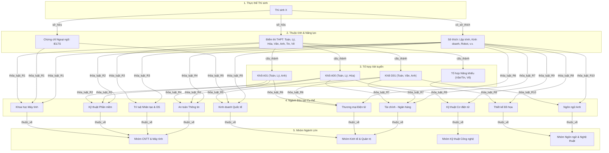

# BÀI TẬP 2: BỘ CƠ SỞ TRI THỨC VÀ MẠNG NGỮ NGHĨA
*(Dành cho Thành viên 1 - Kỹ sư Tri thức)*

---

## 1. Cơ sở Tri thức: Hệ 10+ Luật Dẫn Tuyển sinh (IF-THEN Rules)

Các quy tắc được xây dựng dựa trên sự kết hợp phức tạp giữa: **Điểm các môn thi THPT** (Toán, Lý, Hóa, Văn, Anh, Tin, Vẽ), **Chứng chỉ ngoại ngữ** (IELTS), **Sở thích cá nhân** và **Định hướng nghề nghiệp**.

### Quy ước Ký hiệu:
* $T, L, H, V, A, Tin, Ve$: Điểm số tương ứng các môn Toán, Vật lý, Hóa học, Ngữ văn, Tiếng Anh, Tin học, Năng khiếu Vẽ.
* $A00 = T + L + H$, $A01 = T + L + A$, $D01 = T + V + A$.
* $IELTS$: Điểm chứng chỉ IELTS (nếu có).
* $SoThich$: Sở thích cá nhân của thí sinh.

---

### Danh sách 10 Luật Chi tiết:

* **Luật R1 (Khoa học Máy tính - CS):**
  $$\text{IF } ((T \ge 8.5 \land L \ge 8.0 \land Tin \ge 8.0) \lor (IELTS \ge 7.0 \land T \ge 8.5)) \land SoThich \in \{\text{"Lập trình"}, \text{"Nghiên cứu thuật toán"}\} \implies \text{Ngành = "Khoa học Máy tính"}$$

* **Luật R2 (Kỹ thuật Phần mềm - SE):**
  $$\text{IF } (A00 \ge 24.5 \lor A01 \ge 25.0) \land (T \ge 8.0 \lor Tin \ge 8.5) \land SoThich == \text{"Phát triển ứng dụng"} \implies \text{Ngành = "Kỹ thuật Phần mềm"}$$

* **Luật R3 (Trí tuệ Nhân tạo & Khoa học Dữ liệu - AI & DS):**
  $$\text{IF } (T \ge 9.0 \land L \ge 8.0) \land (Tin \ge 8.0 \lor A \ge 8.0) \land SoThich \in \{\text{"Trí tuệ nhân tạo"}, \text{"Phân tích dữ liệu"}\} \implies \text{Ngành = "Trí tuệ Nhân tạo & Khoa học Dữ liệu"}$$

* **Luật R4 (An toàn Thông tin - Cyber Security):**
  $$\text{IF } (A00 \ge 24.0 \lor A01 \ge 24.0) \land Tin \ge 8.0 \land SoThich == \text{"Bảo mật hệ thống"} \implies \text{Ngành = "An toàn Thông tin"}$$

* **Luật R5 (Kinh doanh Quốc tế - International Business):**
  $$\text{IF } D01 \ge 25.0 \land A \ge 8.5 \land (IELTS \ge 6.5 \lor SoThich == \text{"Giao thương quốc tế"}) \implies \text{Ngành = "Kinh doanh Quốc tế"}$$

* **Luật R6 (Thương mại Điện tử - E-Commerce):**
  $$\text{IF } (A01 \ge 23.5 \lor D01 \ge 24.0) \land T \ge 7.5 \land SoThich \in \{\text{"Kinh doanh online"}, \text{"Công nghệ số"}\} \implies \text{Ngành = "Thương mại Điện tử"}$$

* **Luật R7 (Tài chính - Ngân hàng - Finance):**
  $$\text{IF } (A00 \ge 24.0 \lor D01 \ge 24.5) \land T \ge 8.5 \land SoThich == \text{"Đầu tư tài chính"} \implies \text{Ngành = "Tài chính - Ngân hàng"}$$

* **Luật R8 (Thiết kế Đồ họa / Đa phương tiện - Multimedia Design):**
  $$\text{IF } (V \ge 7.0 \land Ve \ge 8.0) \lor (Tin \ge 8.0 \land Ve \ge 7.5) \land SoThich == \text{"Sáng tạo nghệ thuật"} \implies \text{Ngành = "Thiết kế Đồ họa"}$$

* **Luật R9 (Kỹ thuật Cơ điện tử & Robot - Mechatronics):**
  $$\text{IF } A00 \ge 23.5 \land (T \ge 8.0 \land L \ge 8.0) \land SoThich == \text{"Chế tạo robot"} \implies \text{Ngành = "Kỹ thuật Cơ điện tử"}$$

* **Luật R10 (Ngôn ngữ Anh Thương mại - Business English):**
  $$\text{IF } D01 \ge 24.0 \land A \ge 9.0 \land SoThich == \text{"Giao tiếp & Dịch thuật"} \implies \text{Ngành = "Ngôn ngữ Anh Thương mại"}$$

---

## 2. Sơ đồ Mạng Ngữ Nghĩa (Semantic Network)

Mạng ngữ nghĩa mô tả mối quan hệ thứ bậc giữa:
$$\text{Thí sinh} \xrightarrow{có} \text{Hồ sơ năng lực (Điểm số, Sở thích)} \xrightarrow{xét\_tuyển} \text{Khối xét tuyển} \xrightarrow{thỏa\_mãn} \text{Ngành đào tạo} \xrightarrow{thuộc} \text{Nhóm ngành lớn}$$

### Mã nguồn Sơ đồ Mermaid (Dùng để chèn vào báo cáo):

