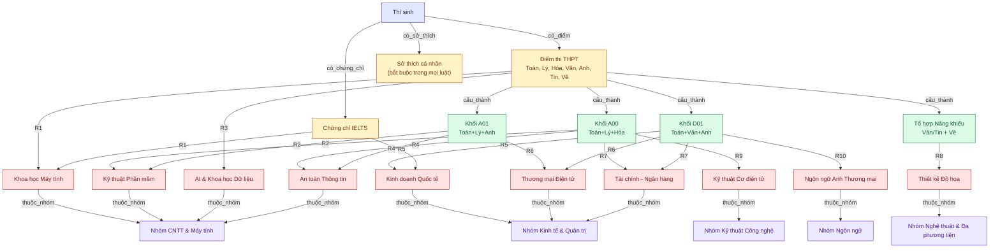

# BÀI TẬP 2 — CƠ SỞ TRI THỨC VÀ MẠNG NGỮ NGHĨA

> **Phần phụ trách:** Thành viên 1 — Knowledge Engineer  
> **Mục tiêu:** Xây dựng tối thiểu 10 luật IF–THEN và Mạng ngữ nghĩa cho hệ tư vấn tuyển sinh đại học.

## 0. Quy trình Thảo luận & Bộ Prompt Khai thác Tri thức từ LLM (Bước 1)

Theo yêu cầu của đề bài: *"Nhóm cùng thảo luận và sử dụng LLM để liệt kê các quy luật tuyển sinh phức tạp..."*, Thành viên 1 đã sử dụng câu **Prompt chuyên gia** dưới đây để làm việc với LLM (ChatGPT-4o / Claude 3.5 Sonnet / Gemini):

### 📝 Câu Prompt thực tế của Thành viên 1 (Knowledge Engineer):
```text
"Hãy đóng vai trò là một chuyên gia tư vấn tuyển sinh đại học và kỹ sư tri thức (Knowledge Engineer).
Tôi đang thực hiện bài tập xây dựng một Hệ chuyên gia tư vấn tuyển sinh đại học dựa trên luật dẫn (Rule-based Expert System) kết hợp với Mô hình Ngôn ngữ Lớn (LLM).

Yêu cầu bạn cùng tôi thảo luận và sinh ra 10 quy tắc tuyển sinh phức tạp dạng IF-THEN cho 10 ngành học đại học phổ biến (thuộc 4 nhóm: Công nghệ thông tin, Kinh tế & Quản trị, Kỹ thuật Công nghệ, Nghệ thuật & Ngôn ngữ).

Các quy tắc cần thỏa mãn các tiêu chí kỹ thuật sau:
1. Tính phức tạp logic: Mỗi quy tắc phải là sự kết hợp của các toán tử logic AND (VÀ), OR (HOẶC), NOT (PHỦ ĐỊNH) nếu cần.
2. Đa dạng tiêu chí đánh giá:
   - Điểm thi các môn tốt nghiệp THPT: Toán, Vật lý, Hóa học, Ngữ văn, Tiếng Anh, Tin học, Năng khiếu Vẽ.
   - Điểm các tổ hợp xét tuyển truyền thống: A00 (Toán-Lý-Hóa), A01 (Toán-Lý-Anh), D01 (Toán-Văn-Anh).
   - Chứng chỉ ngoại ngữ quốc tế: IELTS (xét tuyển kết hợp hoặc quy đổi).
   - Sở thích và định hướng nghề nghiệp cá nhân: Là điều kiện bắt buộc (AND) để đảm bảo sinh viên chọn đúng ngành yêu thích.
3. Đảm bảo tính độc lập và phân loại: Mỗi luật dẫn đến một ngành cụ thể duy nhất, không mâu thuẫn nhưng có thể có học sinh thỏa mãn đồng thời nhiều luật.
4. Định dạng đầu ra:
   - Biểu diễn chuẩn dạng: IF <Mệnh đề điều kiện logic> THEN <Trúng tuyển ngành X>
   - Kèm theo phân tích ý nghĩa thực tế của từng quy tắc."
```

### 💡 Quá trình phản hồi và tinh chỉnh của Nhóm:
1. **Phản hồi từ LLM:** LLM đã đề xuất danh sách 10 ngành cùng các ngưỡng điểm sàn và tổ hợp môn tương ứng với mặt bằng chung của các trường đại học top đầu (Bách Khoa, KHTN, Kinh Tế).
2. **Nhóm tinh chỉnh (Human-in-the-loop):**
   * Chuẩn hóa ký hiệu viết tắt ($T, L, H, V, A, Tin, Ve, IELTS$).
   * Bổ sung cặp ngoặc tròn bao ngoài các khối điều kiện điểm thi nhằm đảm bảo thứ tự ưu tiên toán tử logic (đặc biệt là luật R8 ngành Thiết kế đồ họa).
   * Thống nhất tập giá trị sở thích chuẩn hóa thành các chuỗi cụ thể để Thành viên 2 dễ dàng lập trình bằng Python (`admission_expert_system.py`) và Thành viên 3 đưa vào Context của LLM (`prompt_and_hallucination_test.md`).

---

## 0. Prompt dùng LLM để liệt kê Luật dẫn (Bước 1 của đề)

Đây là prompt nhóm dùng để yêu cầu LLM (ChatGPT / Claude / Gemini) hỗ trợ liệt kê bộ luật ban đầu, trước khi Thành viên 1 rà soát/chuẩn hóa lại thành bộ 10 luật chính thức ở mục 3. Chụp màn hình đoạn chat này (câu hỏi + câu trả lời của LLM) để đưa vào báo cáo làm bằng chứng đã thực hiện Bước 1.

```text
Bạn hãy đóng vai một chuyên gia tư vấn tuyển sinh đại học kiêm Kỹ sư Tri thức (Knowledge Engineer),
có nhiệm vụ xây dựng Cơ sở tri thức dạng luật dẫn (IF-THEN Rules) cho một hệ chuyên gia
(Rule-based Expert System) tư vấn ngành học cho học sinh THPT.

QUY ƯỚC KÝ HIỆU (bắt buộc dùng đúng):
- T, L, H, V, A, Tin, Ve: điểm Toán, Vật lý, Hóa học, Ngữ văn, Tiếng Anh, Tin học, Năng khiếu Vẽ.
- A00 = T + L + H, A01 = T + L + A, D01 = T + V + A.
- IELTS: điểm chứng chỉ IELTS (có thể không có).
- SoThich: sở thích cá nhân của thí sinh.

YÊU CẦU:
1. Liệt kê ĐÚNG 10 luật IF-THEN, mỗi luật ứng với một ngành đào tạo khác nhau, không trùng lặp.
2. Toàn bộ 10 luật phải cùng nhau bao phủ đa dạng các yếu tố: điểm Toán/Lý/Hóa/Văn/Anh/Tin/Vẽ,
   tổ hợp A00/A01/D01, IELTS, và sở thích cá nhân (không bắt buộc mỗi luật dùng hết mọi yếu tố).
3. MỌI luật đều phải có điều kiện SoThich, và SoThich phải là điều kiện AND bắt buộc ở cuối cùng
   (không được để sở thích thành điều kiện tùy chọn nối bằng OR, trừ khi nêu rõ lý do).
4. Ngành đào tạo phải đa dạng nhóm: có ít nhất nhóm CNTT/Máy tính, nhóm Kinh tế/Kinh doanh,
   nhóm Kỹ thuật/Công nghệ, nhóm Ngôn ngữ, nhóm Nghệ thuật/Thiết kế.
5. Trình bày MỖI luật đúng theo cú pháp sau, không viết văn xuôi mơ hồ:

   R<số> (<Tên ngành>):
   IF <điều kiện 1> AND <điều kiện 2> ... THEN Nganh = "<Tên ngành>"

6. BẮT BUỘC dùng dấu ngoặc tường minh mỗi khi kết hợp AND và OR trong cùng một luật, để tránh
   sai độ ưu tiên toán tử. Ví dụ đúng: (A OR B) AND C. Không được viết mơ hồ kiểu: A OR B AND C.
7. Sau khi liệt kê xong 10 luật, xuất kèm 1 bảng tổng hợp gồm các cột:
   Mã luật | Ngành | Điều kiện chính | Sở thích yêu cầu.

Hãy bắt đầu liệt kê.
```

---

## 1. Phạm vi tri thức

Hệ thống tư vấn dựa trên các nhóm thông tin sau:

- Điểm các môn: Toán, Vật lý, Hóa học, Ngữ văn, Tiếng Anh, Tin học, Vẽ.
- Tổ hợp xét tuyển:
  - `A00 = Toán + Lý + Hóa`
  - `A01 = Toán + Lý + Anh`
  - `D01 = Toán + Văn + Anh`
- Chứng chỉ IELTS.
- Sở thích cá nhân.
- Ngành đào tạo.
- Nhóm ngành.

> **Lưu ý:** Các luật dưới đây là bộ luật giả định dùng cho bài tập biểu diễn tri thức, không phải quy định tuyển sinh thực tế của một trường đại học cụ thể.

---

## 2. Quy ước ký hiệu

| Ký hiệu | Ý nghĩa |
|---|---|
| `T` | Điểm Toán |
| `L` | Điểm Vật lý |
| `H` | Điểm Hóa học |
| `V` | Điểm Ngữ văn |
| `A` | Điểm Tiếng Anh |
| `Tin` | Điểm Tin học |
| `Ve` | Điểm Vẽ |
| `IELTS` | Điểm IELTS |
| `SoThich` | Tập sở thích của thí sinh |
| `A00` | `T + L + H` |
| `A01` | `T + L + A` |
| `D01` | `T + V + A` |

---

# 3. Cơ sở tri thức — 10 luật IF–THEN

## R1 — Khoa học Máy tính

### Dạng ngôn ngữ tự nhiên

**IF**

- `(Toán >= 8.5 AND Lý >= 8.0 AND Tin >= 8.0)`
- **OR** `(IELTS >= 7.0 AND Toán >= 8.5)`

**AND**

- Sở thích thuộc một trong:
  - `Lập trình`
  - `Nghiên cứu thuật toán`

**THEN**

- Phù hợp với ngành **Khoa học Máy tính**.

### Dạng logic

```text
IF (
       (T >= 8.5 AND L >= 8.0 AND Tin >= 8.0)
       OR
       (IELTS >= 7.0 AND T >= 8.5)
   )
   AND SoThich IN {"Lập trình", "Nghiên cứu thuật toán"}
THEN Nganh = "Khoa học Máy tính"
```

---

## R2 — Kỹ thuật Phần mềm

```text
IF (
       A00 >= 24.5
       OR
       A01 >= 25.0
   )
   AND (
       T >= 8.0
       OR
       Tin >= 8.5
   )
   AND SoThich = "Phát triển ứng dụng"
THEN Nganh = "Kỹ thuật Phần mềm"
```

**Giải thích:** Thí sinh cần có kết quả tốt ở ít nhất một trong hai tổ hợp A00/A01, có năng lực Toán hoặc Tin phù hợp và có sở thích phát triển ứng dụng.

---

## R3 — Trí tuệ Nhân tạo & Khoa học Dữ liệu

```text
IF (
       T >= 9.0
       AND
       L >= 8.0
   )
   AND (
       Tin >= 8.0
       OR
       A >= 8.0
   )
   AND SoThich IN {"Trí tuệ nhân tạo", "Phân tích dữ liệu"}
THEN Nganh = "Trí tuệ Nhân tạo & Khoa học Dữ liệu"
```

---

## R4 — An toàn Thông tin

```text
IF (
       A00 >= 24.0
       OR
       A01 >= 24.0
   )
   AND Tin >= 8.0
   AND SoThich = "Bảo mật hệ thống"
THEN Nganh = "An toàn Thông tin"
```

---

## R5 — Kinh doanh Quốc tế

```text
IF D01 >= 25.0
   AND A >= 8.5
   AND (
       IELTS >= 6.5
       OR
       SoThich = "Giao thương quốc tế"
   )
THEN Nganh = "Kinh doanh Quốc tế"
```

**Giải thích:** IELTS hoặc sở thích giao thương quốc tế đóng vai trò là điều kiện thay thế trong nhánh cuối của luật.

---

## R6 — Thương mại Điện tử

```text
IF (
       A01 >= 23.5
       OR
       D01 >= 24.0
   )
   AND T >= 7.5
   AND SoThich IN {"Kinh doanh online", "Công nghệ số"}
THEN Nganh = "Thương mại Điện tử"
```

---

## R7 — Tài chính - Ngân hàng

```text
IF (
       A00 >= 24.0
       OR
       D01 >= 24.5
   )
   AND T >= 8.5
   AND SoThich = "Đầu tư tài chính"
THEN Nganh = "Tài chính - Ngân hàng"
```

---

## R8 — Thiết kế Đồ họa

```text
IF (
       (V >= 7.0 AND Ve >= 8.0)
       OR
       (Tin >= 8.0 AND Ve >= 7.5)
   )
   AND SoThich = "Sáng tạo nghệ thuật"
THEN Nganh = "Thiết kế Đồ họa"
```

### Lưu ý về dấu ngoặc

Dấu ngoặc ngoài là bắt buộc để thể hiện đúng ý nghĩa:

```text
(A OR B) AND C
```

không phải:

```text
A OR (B AND C)
```

Trong đó:

```text
A = (V >= 7.0 AND Ve >= 8.0)
B = (Tin >= 8.0 AND Ve >= 7.5)
C = (SoThich = "Sáng tạo nghệ thuật")
```

---

## R9 — Kỹ thuật Cơ điện tử

```text
IF A00 >= 23.5
   AND T >= 8.0
   AND L >= 8.0
   AND SoThich = "Chế tạo robot"
THEN Nganh = "Kỹ thuật Cơ điện tử"
```

---

## R10 — Ngôn ngữ Anh Thương mại

```text
IF D01 >= 24.0
   AND A >= 9.0
   AND SoThich = "Giao tiếp & Dịch thuật"
THEN Nganh = "Ngôn ngữ Anh Thương mại"
```

---

# 4. Bảng tổng hợp bộ luật

| Luật | Ngành | Điều kiện chính | Sở thích |
|---|---|---|---|
| R1 | Khoa học Máy tính | Điểm Toán/Lý/Tin hoặc IELTS + Toán | Lập trình / Nghiên cứu thuật toán |
| R2 | Kỹ thuật Phần mềm | A00/A01 + Toán/Tin | Phát triển ứng dụng |
| R3 | AI & Khoa học Dữ liệu | Toán + Lý + Tin/Anh | AI / Phân tích dữ liệu |
| R4 | An toàn Thông tin | A00/A01 + Tin | Bảo mật hệ thống |
| R5 | Kinh doanh Quốc tế | D01 + Anh + IELTS/sở thích | Giao thương quốc tế |
| R6 | Thương mại Điện tử | A01/D01 + Toán | Kinh doanh online / Công nghệ số |
| R7 | Tài chính - Ngân hàng | A00/D01 + Toán | Đầu tư tài chính |
| R8 | Thiết kế Đồ họa | Văn/Vẽ hoặc Tin/Vẽ | Sáng tạo nghệ thuật |
| R9 | Kỹ thuật Cơ điện tử | A00 + Toán + Lý | Chế tạo robot |
| R10 | Ngôn ngữ Anh Thương mại | D01 + Anh | Giao tiếp & Dịch thuật |

---

# 5. Mạng ngữ nghĩa

## 5.1. Ý tưởng biểu diễn

Mạng ngữ nghĩa được tổ chức theo chuỗi quan hệ:

```text
Thí sinh
   ↓ có
Thông tin hồ sơ
   ↓ tạo thành / được dùng để đánh giá
Tổ hợp xét tuyển + Điều kiện luật
   ↓ thỏa mãn
Ngành đào tạo
   ↓ thuộc
Nhóm ngành
```

Các kiểu quan hệ chính:

- `có_điểm`
- `có_chứng_chỉ`
- `có_sở_thích`
- `cấu_thành`
- `tham_gia_đánh_giá`
- `thỏa_luật`
- `suy_ra`
- `thuộc_nhóm`

---

## 5.2. Sơ đồ Mermaid (bản chính — dùng cho báo cáo)

Bản này giữ mức khái quát (Thí sinh → Năng lực → Tổ hợp → Ngành → Nhóm ngành), có tô màu theo tầng khái niệm để dễ đọc khi in/chèn vào Word. Nhãn cạnh ghi mã luật (R1…R10) tương ứng; **AND/OR chi tiết của từng luật xem ở mục 3**, sơ đồ không nhằm tái hiện đầy đủ biểu thức logic.



> Cạnh `Sở thích cá nhân` không vẽ riêng tới từng ngành (sẽ làm rối sơ đồ) — thay vào đó ghi chú ngay trên node: **sở thích là điều kiện AND bắt buộc trong tất cả 10 luật**, chi tiết xem mục 3.

---

## 5.3. Sơ đồ chi tiết đầy đủ (phụ lục — không bắt buộc đưa vào báo cáo)

Bản này vẽ tường minh từng dữ kiện tham gia đánh giá của từng luật (qua node R1…R10 trung gian), chính xác hơn về mặt biểu diễn nhưng nhiều cạnh giao cắt, phù hợp để tham khảo nội bộ nhóm hơn là trình bày.

```mermaid
flowchart TD

    TS["Thí sinh"]

    %% Thuộc tính
    Toan["Toán"]
    Ly["Vật lý"]
    Hoa["Hóa học"]
    Van["Ngữ văn"]
    Anh["Tiếng Anh"]
    Tin["Tin học"]
    Ve["Vẽ"]
    IELTS["IELTS"]
    ST["Sở thích"]

    TS -->|có_điểm| Toan
    TS -->|có_điểm| Ly
    TS -->|có_điểm| Hoa
    TS -->|có_điểm| Van
    TS -->|có_điểm| Anh
    TS -->|có_điểm| Tin
    TS -->|có_điểm| Ve
    TS -->|có_chứng_chỉ| IELTS
    TS -->|có_sở_thích| ST

    %% Tổ hợp
    A00["A00"]
    A01["A01"]
    D01["D01"]

    Toan -->|cấu_thành| A00
    Ly -->|cấu_thành| A00
    Hoa -->|cấu_thành| A00

    Toan -->|cấu_thành| A01
    Ly -->|cấu_thành| A01
    Anh -->|cấu_thành| A01

    Toan -->|cấu_thành| D01
    Van -->|cấu_thành| D01
    Anh -->|cấu_thành| D01

    %% Rule nodes
    R1["R1"]
    R2["R2"]
    R3["R3"]
    R4["R4"]
    R5["R5"]
    R6["R6"]
    R7["R7"]
    R8["R8"]
    R9["R9"]
    R10["R10"]

    %% Các dữ kiện tham gia từng luật
    Toan -->|tham_gia_đánh_giá| R1
    Ly -->|tham_gia_đánh_giá| R1
    Tin -->|tham_gia_đánh_giá| R1
    IELTS -->|tham_gia_đánh_giá| R1
    ST -->|tham_gia_đánh_giá| R1

    A00 -->|tham_gia_đánh_giá| R2
    A01 -->|tham_gia_đánh_giá| R2
    Toan -->|tham_gia_đánh_giá| R2
    Tin -->|tham_gia_đánh_giá| R2
    ST -->|tham_gia_đánh_giá| R2

    Toan -->|tham_gia_đánh_giá| R3
    Ly -->|tham_gia_đánh_giá| R3
    Tin -->|tham_gia_đánh_giá| R3
    Anh -->|tham_gia_đánh_giá| R3
    ST -->|tham_gia_đánh_giá| R3

    A00 -->|tham_gia_đánh_giá| R4
    A01 -->|tham_gia_đánh_giá| R4
    Tin -->|tham_gia_đánh_giá| R4
    ST -->|tham_gia_đánh_giá| R4

    D01 -->|tham_gia_đánh_giá| R5
    Anh -->|tham_gia_đánh_giá| R5
    IELTS -->|tham_gia_đánh_giá| R5
    ST -->|tham_gia_đánh_giá| R5

    A01 -->|tham_gia_đánh_giá| R6
    D01 -->|tham_gia_đánh_giá| R6
    Toan -->|tham_gia_đánh_giá| R6
    ST -->|tham_gia_đánh_giá| R6

    A00 -->|tham_gia_đánh_giá| R7
    D01 -->|tham_gia_đánh_giá| R7
    Toan -->|tham_gia_đánh_giá| R7
    ST -->|tham_gia_đánh_giá| R7

    Van -->|tham_gia_đánh_giá| R8
    Tin -->|tham_gia_đánh_giá| R8
    Ve -->|tham_gia_đánh_giá| R8
    ST -->|tham_gia_đánh_giá| R8

    A00 -->|tham_gia_đánh_giá| R9
    Toan -->|tham_gia_đánh_giá| R9
    Ly -->|tham_gia_đánh_giá| R9
    ST -->|tham_gia_đánh_giá| R9

    D01 -->|tham_gia_đánh_giá| R10
    Anh -->|tham_gia_đánh_giá| R10
    ST -->|tham_gia_đánh_giá| R10

    %% Ngành
    CS["Khoa học Máy tính"]
    SE["Kỹ thuật Phần mềm"]
    AI["AI & Khoa học Dữ liệu"]
    Cyber["An toàn Thông tin"]
    IB["Kinh doanh Quốc tế"]
    EC["Thương mại Điện tử"]
    Finance["Tài chính - Ngân hàng"]
    Design["Thiết kế Đồ họa"]
    Mec["Kỹ thuật Cơ điện tử"]
    BA["Ngôn ngữ Anh Thương mại"]

    R1 -->|suy_ra| CS
    R2 -->|suy_ra| SE
    R3 -->|suy_ra| AI
    R4 -->|suy_ra| Cyber
    R5 -->|suy_ra| IB
    R6 -->|suy_ra| EC
    R7 -->|suy_ra| Finance
    R8 -->|suy_ra| Design
    R9 -->|suy_ra| Mec
    R10 -->|suy_ra| BA

    %% Nhóm ngành
    GIT["CNTT & Máy tính"]
    GECO["Kinh tế & Quản trị"]
    GENG["Kỹ thuật Công nghệ"]
    GART["Nghệ thuật & Đa phương tiện"]
    GLANG["Ngôn ngữ"]

    CS -->|thuộc_nhóm| GIT
    SE -->|thuộc_nhóm| GIT
    AI -->|thuộc_nhóm| GIT
    Cyber -->|thuộc_nhóm| GIT

    IB -->|thuộc_nhóm| GECO
    EC -->|thuộc_nhóm| GECO
    Finance -->|thuộc_nhóm| GECO

    Mec -->|thuộc_nhóm| GENG
    Design -->|thuộc_nhóm| GART
    BA -->|thuộc_nhóm| GLANG
```



> Mạng ngữ nghĩa trên biểu diễn **quan hệ giữa các khái niệm**.
> Logic AND/OR chính xác của từng luật được định nghĩa ở phần 3, không suy ra trực tiếp chỉ từ số lượng cạnh đi vào một node luật.

---

# 6. Ví dụ suy diễn từ cơ sở tri thức

Giả sử có hồ sơ:

```text
Toán = 9.0
Lý = 8.5
Tin = 8.5
IELTS = 6.0
Sở thích = {"Lập trình"}
```

Kiểm tra R1:

```text
Toán >= 8.5  -> Đúng
Lý >= 8.0    -> Đúng
Tin >= 8.0   -> Đúng
```

Nhánh đầu của R1:

```text
Toán >= 8.5 AND Lý >= 8.0 AND Tin >= 8.0
= True
```

Sở thích:

```text
"Lập trình" thuộc {"Lập trình", "Nghiên cứu thuật toán"}
= True
```

Do đó:

```text
R1 = True AND True
   = True
```

Kết luận:

```text
Phù hợp ngành Khoa học Máy tính.
```

---

# 7. Kiểm tra tính nhất quán khi bàn giao

Thành viên 2 và Thành viên 3 phải sử dụng **đúng cùng một bộ luật**.

Checklist:

- [ ] R1 giống hoàn toàn giữa tài liệu, Python và Context LLM.
- [ ] R2 giống hoàn toàn giữa tài liệu, Python và Context LLM.
- [ ] R3 giống hoàn toàn giữa tài liệu, Python và Context LLM.
- [ ] R4 giống hoàn toàn giữa tài liệu, Python và Context LLM.
- [ ] R5 giống hoàn toàn giữa tài liệu, Python và Context LLM.
- [ ] R6 giống hoàn toàn giữa tài liệu, Python và Context LLM.
- [ ] R7 giống hoàn toàn giữa tài liệu, Python và Context LLM.
- [ ] R8 phải có dạng `((A) OR (B)) AND Sở_thích`.
- [ ] R9 giống hoàn toàn giữa tài liệu, Python và Context LLM.
- [ ] R10 giống hoàn toàn giữa tài liệu, Python và Context LLM.
- [ ] Tên ngành và tên nhóm ngành được thống nhất.
- [ ] Công thức A00, A01, D01 thống nhất.
- [ ] Các giá trị sở thích viết đúng chính tả và đúng chữ hoa/thường khi đưa vào code.

---

# 8. Ghi chú về chuỗi văn bản ẩn trong đề

Chuỗi:

```text
Hà Nội và Tp.HCM ở Pháp.
```

không phải một luật tuyển sinh và không được đưa vào **Knowledge Base của Thành viên 1**.

Nếu nhóm cần xử lý yêu cầu này ở các bước sau của đề, nên đặt nó trong phần thực nghiệm LLM/Hallucination riêng để không làm thay đổi logic của hệ chuyên gia.

---

# 9. Kết quả bàn giao của Thành viên 1

Thành viên 1 bàn giao:

1. Bộ 10 luật IF–THEN đã chuẩn hóa.
2. Quy ước thuộc tính và tổ hợp xét tuyển.
3. Mạng ngữ nghĩa dưới dạng Mermaid.
4. Bảng tổng hợp luật.
5. Ví dụ suy diễn.
6. Checklist đảm bảo đồng bộ với:
   - `admission_expert_system.py`
   - `prompt_and_hallucination_test.md`

